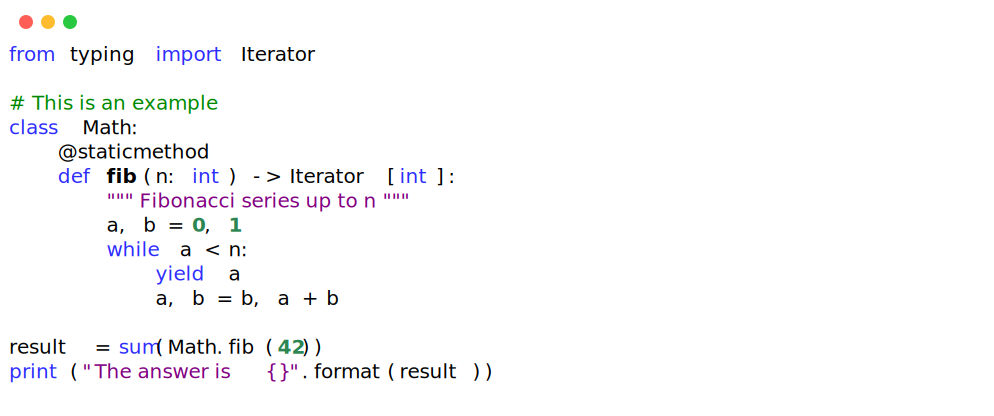
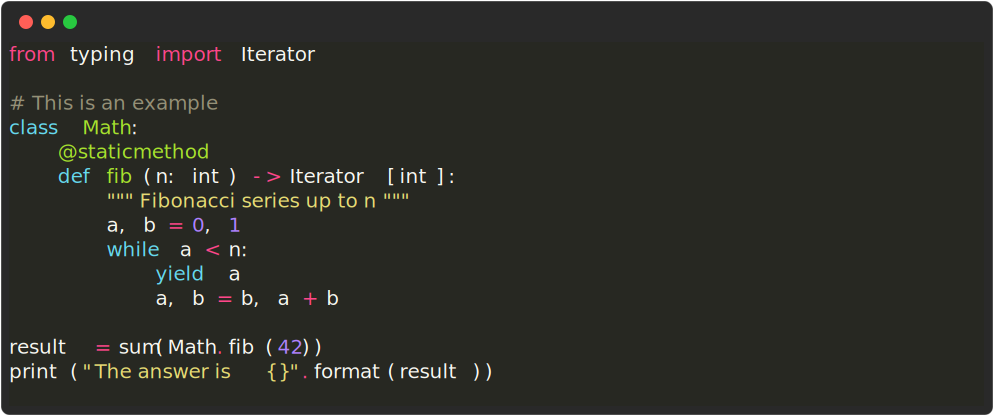
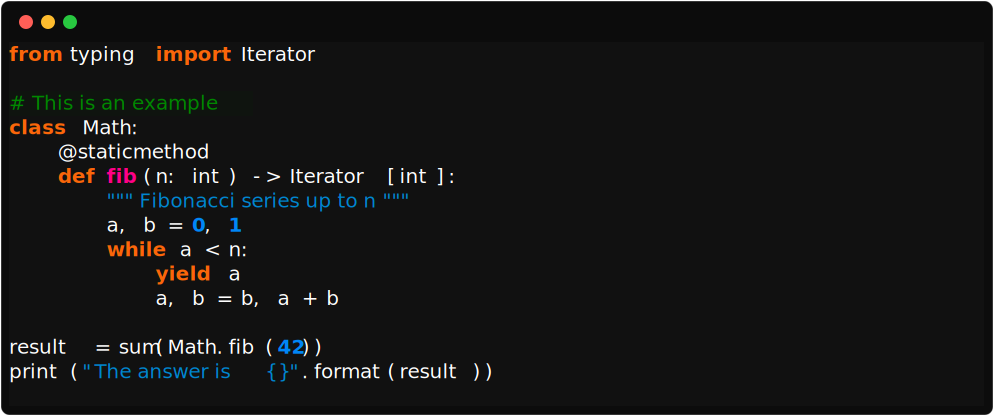

## Using a pseudo-terminal

By default, rich-codex runs commands in a Python `subprocess`. This is not an interactive terminal, and as such many command-line tools will disable coloured output.

This is best solved at the tool level if possible, by telling the tool to force coloured output. However, if this is not possible then you can use `--use-pty` / `$USE_PTY` / `use_pty` (CLI, env var, action/config). This uses a [Python `pty` pseudo-terminal](https://docs.python.org/dev/library/pty.html) instead of [`subprocess`](https://docs.python.org/dev/library/subprocess.html) which may trick your tool into keeping coloured output.

<!-- prettier-ignore-start -->
!!! warning
    Note that PTY almost certainly won't work on Windows and is generally more likely to do weird stuff / create poorly formatted outputs than the default subprocess shell.
<!-- prettier-ignore-end -->

## Colour theme

You can customise the theme using `--terminal-theme` / `$TERMINAL_THEME` / `terminal_theme` (CLI, env, action/config).

Themes are taken from [Rich](https://github.com/Textualize/rich/blob/master/rich/terminal_theme.py), at the time of writing the following are available:

- `DEFAULT_TERMINAL_THEME`
- `MONOKAI`
- `DIMMED_MONOKAI`
- `NIGHT_OWLISH`
- `SVG_EXPORT_THEME`

The terminal theme should be set as a string to one of these values.

<!-- prettier-ignore-start -->
!!! note
    It's planned to add support for custom themes but not yet implemented. If you need this, please create a GitHub issue / pull-request.
<!-- prettier-ignore-end -->

`DEFAULT_TERMINAL_THEME`:

<!-- RICH-CODEX terminal_theme: DEFAULT_TERMINAL_THEME -->

`MONOKAI`:

<!-- RICH-CODEX terminal_theme: MONOKAI -->

`DIMMED_MONOKAI`:

<!-- RICH-CODEX terminal_theme: DIMMED_MONOKAI -->

`NIGHT_OWLISH`:

<!-- RICH-CODEX terminal_theme: NIGHT_OWLISH -->

`SVG_EXPORT_THEME`:

<!-- RICH-CODEX terminal_theme: SVG_EXPORT_THEME -->

## Snippet colours

Snippets are formatted using [rich Syntax objects](https://rich.readthedocs.io/en/stable/syntax.html).
These use Pygments to add code colouring, which has its own set of themes - separate to the terminal theme that the snippet is wrapped in.

As such, if using snippets, you'll probably want to set both the terminal theme and the Pygments style.
You can find available Pygments styles in the [Pygments docs](https://pygments.org/docs/styles/#getting-a-list-of-available-styles).

`snippet_theme: xcode` + `terminal_theme: DEFAULT_TERMINAL_THEME`:

<!-- RICH-CODEX
terminal_theme: DEFAULT_TERMINAL_THEME
snippet_theme: sas
snippet_syntax: python
snippet: |
    from typing import Iterator

    # This is an example
    class Math:
        @staticmethod
        def fib(n: int) -> Iterator[int]:
            """ Fibonacci series up to n """
            a, b = 0, 1
            while a < n:
                yield a
                a, b = b, a + b

    result = sum(Math.fib(42))
    print("The answer is {}".format(result))
-->

`snippet_theme: monokai` + `terminal_theme: SVG_EXPORT_THEME`:

<!-- RICH-CODEX
terminal_theme: SVG_EXPORT_THEME
snippet_theme: monokai
snippet_syntax: python
snippet: |
    from typing import Iterator

    # This is an example
    class Math:
        @staticmethod
        def fib(n: int) -> Iterator[int]:
            """ Fibonacci series up to n """
            a, b = 0, 1
            while a < n:
                yield a
                a, b = b, a + b

    result = sum(Math.fib(42))
    print("The answer is {}".format(result))
-->

`snippet_theme: fruity` + `terminal_theme: MONOKAI`:

<!-- RICH-CODEX
terminal_theme: MONOKAI
snippet_theme: fruity
snippet_syntax: python
snippet: |
    from typing import Iterator

    # This is an example
    class Math:
        @staticmethod
        def fib(n: int) -> Iterator[int]:
            """ Fibonacci series up to n """
            a, b = 0, 1
            while a < n:
                yield a
                a, b = b, a + b

    result = sum(Math.fib(42))
    print("The answer is {}".format(result))
-->

