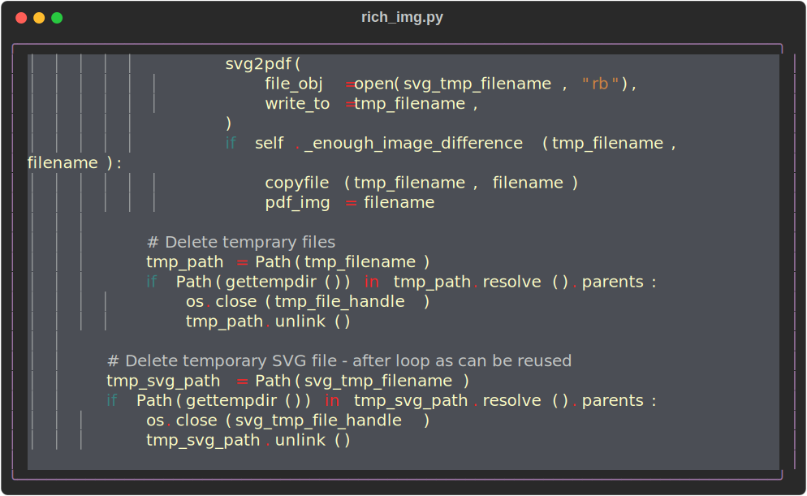

## Running commands

If you write markdown with images that contain _just_ a `backtick command` as the alt-text, rich-codex will find them.

For example, the following markdown will generate `../img/rich-codex-help.svg` (the image shown above) based on the output of the command `rich-codex --help`:

```markdown
Wow, this documentation is really getting meta!

```

## Printing files

Rich-codex bundles [rich-cli](https://github.com/Textualize/rich-cli) for convenience, so you can easily produce screenshots of files with the `rich` command:

```markdown

```


<!-- prettier-ignore-start -->
!!! tip
    💡 Use the `--force-terminal` flag to keep colours in your screenshots
<!-- prettier-ignore-end -->

## Title text

You can also add [title text](https://daringfireball.net/projects/markdown/syntax#img) in quotes after the filename, which will be used in the top menu bar of the screenshot terminal.
This can be useful when adding lots of command markup to get a good screenshot. For example:

```markdown
You don't always want people to see the exact command you used, after all.

```



## Config comments

Finally, you can use a HTML comment in a line above the image to set config attributes for this image only.
The comment should begin with `RICH-CODEX` and then have `KEY=VALUE` pairs. Available configs are:

- `SKIP`: Skip this image
- `MIN_PCT_DIFF`: Minimum file percentage change required to update image
- `SKIP_CHANGE_REGEX`: Skip image update if file changes match regex
- `TERMINAL_WIDTH`: Set terminal width
- `TERMINAL_THEME`: Set terminal theme
- `USE_PTY`: Use a pseudo-terminal for commands (may capture coloured output)

For example:

<!-- prettier-ignore-start -->

```markdown
<!-- RICH-CODEX TERMINAL_WIDTH=60 TERMINAL_THEME=MONOKAI -->

```

<!-- RICH-CODEX TERMINAL_WIDTH=60 TERMINAL_THEME=MONOKAI -->


<!-- prettier-ignore-end -->

## Code snippets

In addition to running commands, you can format code blocks or "snippets".

To do this, make the `<!-- RICH-CODEX` code comment multi-line. Config key-pairs stay on the first line and anything on subsequent lines before the closing `-->` will be treated as the snippet. Then follow the code comment with a markdown image tag (again, the filename will be taken for the generated image).

<!-- prettier-ignore-start -->

!!! info
    The alt-text for the markdown image embed doesn't matter for snippets. However, if it has a command in backticks then this will take priority over the snippet.

Syntax highlighting defaults to JSON if the snippet is valid JSON, and is otherwise uncoloured:

```markdown
<!-- RICH-CODEX
{"menu": {
  "id": "file", "value": "File",
  "popup": {
    "menuitem": [
      {"value": "New", "onclick": "CreateNewDoc()"},
      {"value": "Open", "onclick": "OpenDoc()"},
      {"value": "Close", "onclick": "CloseDoc()"}
    ]
  }
}}
-->

```


For other code languages, use `SNIPPET_SYNTAX` to define which language to format in. For example:

```markdown
<!-- RICH-CODEX SNIPPET_SYNTAX=python TERMINAL_WIDTH=80
>>> print("[italic red]Hello[/italic red] World!", locals())
Hello World!
{
    '__annotations__': {},
    '__builtins__': <module 'builtins' (built-in)>,
    '__doc__': None,
    '__loader__': <class '_frozen_importlib.BuiltinImporter'>,
    '__name__': '__main__',
    '__package__': None,
    '__spec__': None,
    'print': <function print at 0x1027fd4c0>,
}
-->

```


!!! note
    Note that all other key-value pairs above also work for snippets.

<!-- prettier-ignore-end -->
